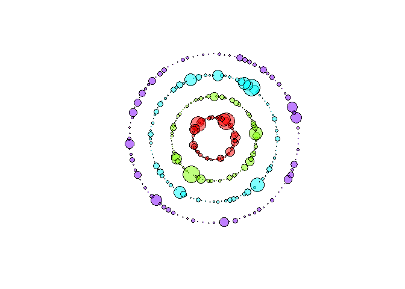

<!-- README.md is generated from README.Rmd. Please edit that file -->

# RepertoireGraphs

<!-- badges: start -->

[](https://travis-ci.com/IdoHassonJ/RepertoireGraphs)
<!-- badges: end -->

The goal of RepertoireGraphs is to… Repertoire Graphical Visualization

## Installation

For RepertoireGraphs installation execute the following command:

``` r
install.packages("RepertoireGraphs")
```

or

``` r
library(devtools)
devtools::install_github("IdoHassonJ/RepertoireGraphs")
```

## Example

Load the package and create TCR/BCR dataset with arbitrary sequences &
values:

``` r
library(RepertoireGraphs)
data <- matrix(rexp(400,1/4), ncol = 4)
aa <- c("G", "A", "V", "L", "I", "P", "F", "Y", "W", "S",
        "T", "N", "Q", "C", "M", "D", "E", "H", "K", "R") # amino acid symbols
seq <- replicate(nrow(data), paste0(sample(aa, 10), collapse = ""))
rownames(data) <- seq
colnames(data) <- LETTERS[seq(ncol(data))]

head(data)
#>                     A         B        C          D
#> FWTVCKRMPQ  1.3787700  4.843387 6.206484  0.4850474
#> INHPWKCEFT 11.7785264  9.198948 1.090124  1.9019068
#> NQRTGHKDYW  2.3793485 16.613160 4.609377  3.9132916
#> FCPIQDAHRY  9.4815834  2.744772 2.054159  0.5032794
#> YSIVMFNDER  0.3059486  7.298837 1.701462 13.8168453
#> WNPSLYFRCV  0.9662928  6.823992 6.187878  5.9685597
```

Now we can execute sunflower function:

``` r
sunflower(data)
```



More examples are available in package help:

``` r
?network
?cr_source
```
