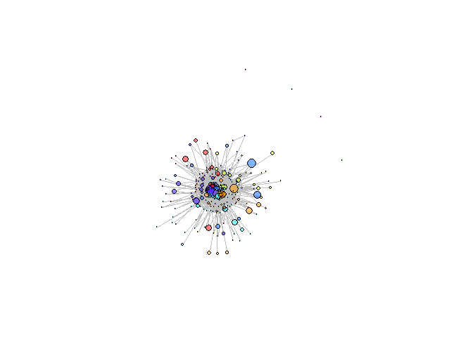

<!-- README.md is generated from README.Rmd. Please edit that file -->

# RepertoiR

Different methods to visualize your TCR/BCR repertoire output files of
various formats options, including a comparison of sequence frequency
among samples, network representation of similar sequences and
convergent recombination source between species.

## Installation

You can install the development version of RepertoireGraphs from version from GitHub with:

``` r
# install.packages("devtools")
devtools::install_github("IdoHassonJ/RepertoireGraphs")
```

## Quick demo

Creating network graph of TCR repertoire’s clonotypes:

``` r
library(RepertoireGraphs)

aa <- c(
  "G", "A", "V", "L", "I", "P", "F", "Y", "W", "S",
  "T", "N", "Q", "C", "M", "D", "E", "H", "K", "R"
)
data <- matrix(rexp(1 / 2, n = 1000), ncol = 4)
cons <- sample(aa, 10)
aavec <- c()

while (length(aavec) < nrow(data)) {
  aaseq <- cons
  index <- sample(length(aaseq), sample(length(aaseq) / 3, 1))
  aaseq[index] <- sample(aa, length(index), replace = TRUE)
  aaseq <- paste0(aaseq, collapse = "")
  aavec <- unique(append(aavec, aaseq))
}

rownames(data) <- aavec
colnames(data) <- LETTERS[1:ncol(data)]
```



In that case, don’t forget to commit and push the resulting figure
files, so they display on GitHub and CRAN.
